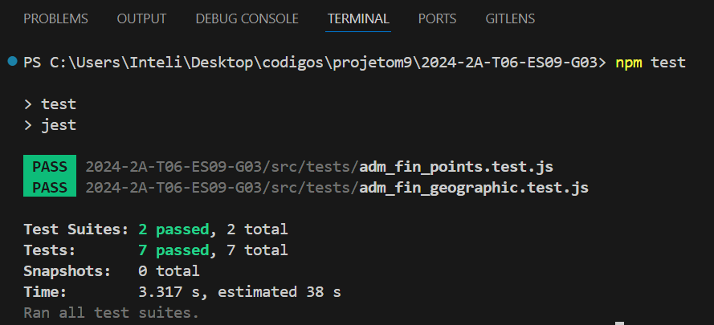
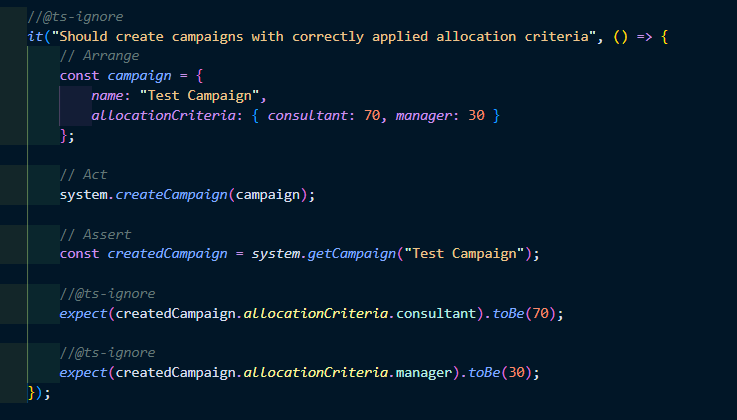
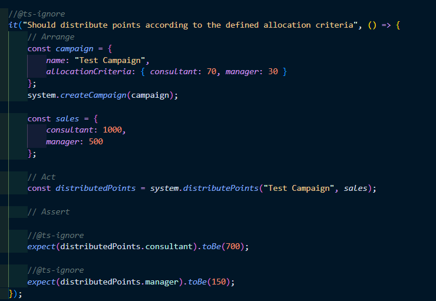
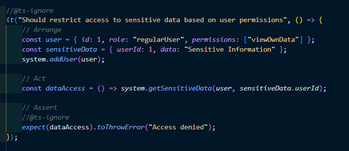
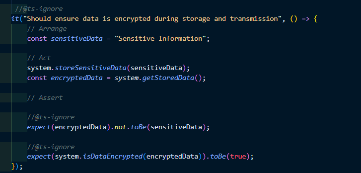
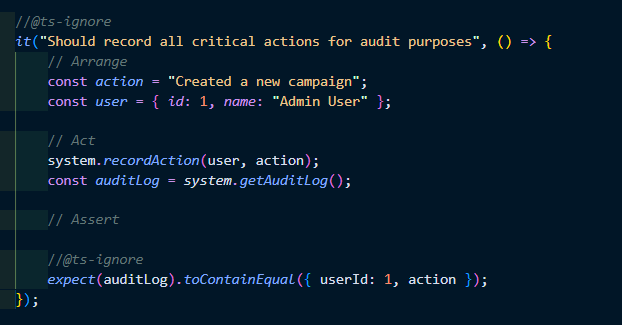
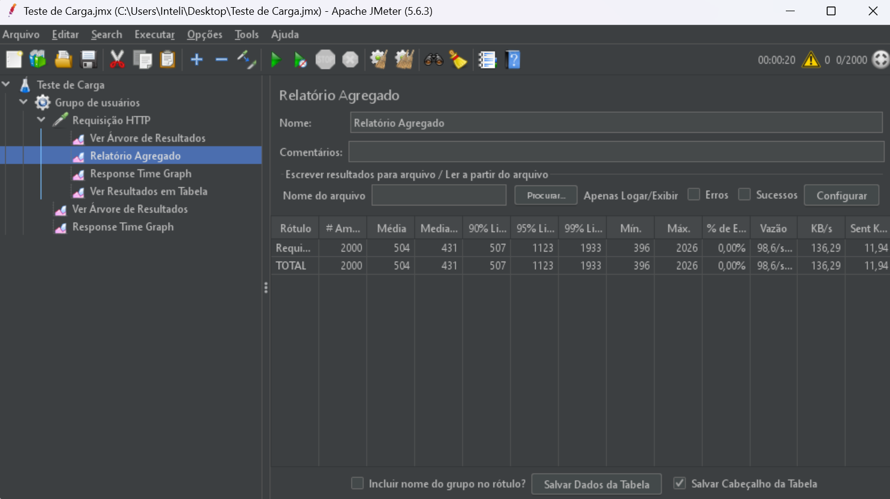

## Sumário 
- [Sprint 1](#sprint-1)
    - [Compreensão do problema](#compreensão-do-problema)
    - [Definição dos Business Drivers](#definição-dos-business-drivers)
    - [1° Escopo da solução](#1-escopo-de-solução)
- [Sprint 2](#sprint-2)
    - [Teste de Login - Usuário final](#teste-de-login---usuário-final)
- [Sprint 3](#sprint-3)
    - [Rastreabilidade](#rastreabilidade)
    - [Tolerância a Falhas](#tolerancia-a-falha)
- [Sprint 4](#sprint-4)
- [Sprint 5](#sprint-5)

# Sprint 1
Diagnótico de controle de qualidade pelo sistema

## Compreensão do problema 

O aplicativo desenvolvido em React Native, atualmente em produção em várias empresas que atuam nos ramos de esportes e loyalty, enfrenta desafios significativos devido à falta de testes automatizados. Essa deficiência está causando problemas recorrentes, especialmente considerando que o app serve como interface crítica para soluções que incluem uma API Rest conectada ao Salesforce e ao Firebase, que lida com atualizações em tempo real. Identificamos três pilares para guiar os testes e foco no usuário final e Business Drivers envolvidos:

- 1. **Confiabilidade**:
   - Para melhorar a confiabilidade, a implementação de uma suíte abrangente de testes automatizados é essencial. Isso incluiria testes unitários, de integração e de ponta a ponta, garantindo que cada componente funcione corretamente, tanto isoladamente quanto em conjunto. A automação desses testes permitirá a detecção precoce de falhas e problemas de integração, reduzindo a incidência de bugs em produção.

- 2. **Disponibilidade**:
   - A disponibilidade do aplicativo pode ser garantida através da monitorização contínua e do uso de práticas como o teste de carga e stress. Isso garantirá que o sistema possa lidar com picos de demanda, especialmente em eventos que envolvem grandes volumes de usuários simultâneos, como ações de marketing ou grandes eventos esportivos. Além disso, a adoção de técnicas de redundância e failover permitirá que o aplicativo continue funcionando mesmo em caso de falhas em componentes críticos.

- 3. **Segurança**:
   - A segurança é crucial, especialmente considerando que o aplicativo lida com dados sensíveis e interage com sistemas de terceiros como Salesforce e Firebase. Implementar práticas rigorosas de segurança no desenvolvimento e operações, incluindo a realização de testes de segurança automatizados, auditorias de código e a implementação de práticas de DevSecOps, ajudará a proteger o aplicativo contra vulnerabilidades e ataques. Além disso, o uso de autenticação forte e criptografia de dados garantirá que as informações do usuário sejam protegidas em todas as etapas.

## Definição dos Business Drivers 
Compreensão do estágio de controle de qualidade para os stakeholders envolvidos: 

### 1 Cliente Final
# Diagnóstico de Qualidade do Bounded Context: Login / Logout
## 1. Volume de Serviços e Sazonalidade
- **Volume de Serviços:** O sistema processa autenticações de usuários finais em diferentes momentos, gerando um volume variável de solicitações ao longo do tempo. A integração com Salesforce e outros sistemas em tempo real adiciona complexidade ao controle de acesso.
- **Sazonalidade:** A demanda por autenticações pode variar significativamente, especialmente em períodos de alto tráfego como eventos esportivos ou campanhas de fidelização. É essencial que o sistema de Login / Logout suporte picos de demanda sem comprometer a performance.

## 2. Disponibilidade
- **Garantia de Serviço:** A disponibilidade contínua do sistema de Login / Logout é crucial, dado que a autenticação é um ponto de entrada vital para todas as funcionalidades do aplicativo. Falhas nesse contexto podem impactar negativamente a experiência do usuário final e a confiança na solução.
- **Estratégias de Redundância:** Para assegurar alta disponibilidade, é necessário implementar estratégias de redundância e failover, garantindo que o serviço permaneça funcional mesmo em casos de falhas.

## 3. Segurança e Privacidade
- **Segurança-Privacidade:** O sistema de Login / Logout deve proteger rigorosamente os dados dos usuários, utilizando criptografia avançada tanto em repouso quanto em trânsito. O cumprimento de normas de proteção de dados, como a LGPD, é imprescindível para evitar penalidades e garantir a confiança dos usuários.
- **Segurança-Integridade:** A integridade dos dados de autenticação deve ser garantida, prevenindo quaisquer tentativas de acesso não autorizado ou adulteração de dados. Medidas como autenticação multifator (MFA) e monitoramento contínuo de atividades suspeitas são recomendadas.

## 4. Não-Repúdio
- **Garantia de Transações:** Cada ação de Login / Logout deve ser registrável e auditável, garantindo que não possa ser negada posteriormente. Esse princípio é essencial para resolver disputas e assegurar a transparência das operações.

## 5. Tempos de Resposta
- **Performance:** O tempo de resposta para operações de Login / Logout deve ser minimizado, garantindo uma experiência fluida e rápida para os usuários. A otimização das chamadas à API e a eficiência na comunicação com sistemas como o Salesforce são fundamentais para atingir tempos de resposta ideais.

#### Conclusão
A análise do bounded context de Login / Logout revela que a qualidade do sistema depende fortemente da robustez dos mecanismos de segurança, da eficiência em lidar com picos de demanda e da garantia de alta disponibilidade. Implementações focadas em redundância, segurança avançada e otimização de performance são cruciais para atender aos stakeholders tanto em termos de confiabilidade quanto de experiência do usuário.

## Executivo focando em Administrativo e Financeiro 

### Executivo focando em Operações

A proposta desse **Business Driver**, é garantir que o sistema seja capaz de sustentar a operação contínua e eficiente sob diferentes níveis de demanda, especialmente em cenários de alta carga. 

**Entendimento da Proposta do Business Driver e Necessidade com o Sistema**:

- 1. **Garantir Estabilidade em Operações Normais**:
   - O Business Driver está preocupado com a estabilidade do sistema durante operações diárias típicas. A primeira fase do teste, que simula um dia normal de acessos, verifica se o sistema pode gerenciar um volume regular de tráfego sem degradação de desempenho. Isso é essencial para garantir uma experiência consistente para os usuários em condições normais.
- 2. **Preparação para Eventos de Alta Demanda**:
   - O executivo está igualmente focado em preparar o sistema para eventos especiais ou imprevistos que gerem picos de demanda, como promoções, lançamentos ou eventos planejados ("GameDay"). A segunda fase do teste simula uma carga extrema, com até 1000 usuários por segundo, para assegurar que o sistema pode escalar e manter a performance durante esses momentos críticos.
- 3. **Mitigação de Riscos Operacionais**:
   - A realização desses testes de carga permite ao Business Driver identificar e mitigar riscos associados à escalabilidade e resiliência do sistema. Saber que o sistema pode suportar grandes volumes de tráfego reduz a possibilidade de falhas operacionais que poderiam impactar negativamente a continuidade do negócio.
- 4. **Otimização da Experiência do Cliente**:
   - Ao garantir que o sistema funcione de forma eficiente mesmo em picos de tráfego, o Business Driver está focado em manter uma experiência positiva para os clientes, evitando tempos de resposta lentos, falhas ou indisponibilidades que poderiam resultar em perda de receita ou danos à reputação da empresa.
**Necessidade com o Sistema**:
- O sistema precisa ser escalável, robusto e resiliente, capaz de lidar tanto com o tráfego regular quanto com picos significativos sem comprometer o desempenho. Isso inclui garantir tempos de resposta rápidos, evitar falhas durante alta demanda e, possivelmente, identificar e corrigir gargalos ou fraquezas na infraestrutura antes que afetem a operação real.

### Executivo focando em Compliance 

#### Estágio de Controle de Qualidade do Sistema - Acessa Agro Salesforce

##### Conformidade com Regras de Rateio

O sistema está sendo rigorosamente testado para garantir que os **critérios de rateio** sejam implementados de acordo com as políticas corporativas e regulatórias. As principais verificações incluem:
- Aplicação correta das regras de campanha e distribuição de pontos para perfis de **consultores** e **gerentes**.
- Confirmação de que todas as funcionalidades relacionadas ao rateio estão funcionando conforme as diretrizes estabelecidas.

##### Segurança e Integridade dos Dados

Testes de controle de qualidade estão focados na segurança e integridade dos dados, assegurando que:
- Dados sensíveis, como informações de campanhas e registros de vendas, sejam gerenciados de forma segura.
- Acesso controlado e proteção de dados sejam implementados para usuários **pessoa física** e **pessoa jurídica**, alinhados aos padrões de segurança exigidos.

##### Auditoria de Processos e Rastreabilidade

O sistema está sendo validado para garantir que todas as ações sejam:
- Devidamente registradas e auditáveis, proporcionando transparência e rastreabilidade para auditorias internas e externas.
- Documentadas de maneira que atendam às exigências de compliance, tanto para **transações de usuários individuais** quanto para **operações empresariais**.

##### Precisão nas Transações e Relatórios

O estágio de QA inclui verificações rigorosas para assegurar que:
- As funcionalidades de **geração de invoices** e **registros de vendas (Sales Records)** operem corretamente.
- As transações financeiras e os pontos de gamificação atribuídos sejam precisos, evitando problemas de conformidade financeira.

##### Gestão de Riscos de Compliance

Durante o processo de QA, qualquer falha que possa comprometer a conformidade é imediatamente abordada com:
- Implementação de correções antes da liberação do sistema.
- Garantia de que as campanhas de gamificação e critérios associados sejam executados conforme as diretrizes, minimizando o risco de não conformidade.


### Executivo focando em Relações de Mercado e ESG

Do ponto de vista de relações de mercado e ESG, os seguintes business drivers devem ser considerados:

#### Coleta de métricas de interação para análise de perfil de usuário

É importante para metrificar a interação de parceiros e seus interesses dentro do aplicativo. Para isso, deve-se realizar testar a fim de garantir que métricas de interação de uso sejam salvas.
- Registro de métricas de interação como clique em botões e tempo de tela

#### Sistema de loyalty afim de garantir relacionamento com parceiros

Uma importante ferramente de fidelização de parceiros é o programa de loyalty. Assim, deve-se garantir seu funcionamento.
- Subscribe ao programa de Loyalty
- Experiência fluida com público de 500 subscrições por hora em horários de pico 

#### Campanhas de produtos

Devido ao setor concorrido do aplicativo, aproveitar os eventos anuais é importante para a captação de novos parceiros.
- Criação de campanhas
- Visualização de campanha com público de até 10.000 usuários por hora

## 1° Escopo de solução 
Focamos em atender as demandas para cada Business Drivers envolvidos ou afetados pelo sistema:

## Cliente Final

### Objetivo
Escrever na forma de testes o controle de qualidade do sistema sob a perspectiva dos **business drivers**, atendendo às necessidades dos stakeholders, tanto pessoa física quanto pessoa jurídica.

### Itens Avaliados:
1. **Volume de Serviços e Sazonalidade**
2. **Disponibilidade**
3. **Segurança-Privacidade**
4. **Segurança-Integridade**
5. **Não-Repúdio**
6. **Tempos de Resposta**

### Metodologia de Teste
Os testes serão desenvolvidos utilizando mocks com comportamento controlado, ao invés de simples mocks rebatedores. O comportamento dos mocks será configurado com base em dados estatísticos reais, simulando diferentes condições de retorno para evidenciar a abrangência e robustez dos testes.

### Exemplos de Testes

#### 1. Volume de Serviços e Sazonalidade

```go
func TestVolumeDeServicosSazonalidade(t *testing.T) {
    mockService := NewMockService()

    for i := 0; i <= 30000; i += 5000 {
        var retorno string

        switch {
        case i > 20000:
            retorno = "Pico de Demanda"
        case i > 10000:
            retorno = "Pico Normal"
        default:
            retorno = "Baixa Demanda"
        }

        mockService.On("GetVolumeDeServicos", "rampa").Return(retorno)

        volume := mockService.GetVolumeDeServicos("rampa")
        assert.Equal(t, retorno, volume, fmt.Sprintf("O volume de serviços deve ser %s na iteração correspondente.", retorno))
    }
}


func TestDisponibilidadeServico(t *testing.T) {
    mockService := NewMockService()
    
    // Simular serviço disponível
    mockService.On("CheckDisponibilidade").Return(true)
    
    // Simular falha de serviço
    mockService.On("CheckDisponibilidade").Return(false).Once()
    
    assert.True(t, mockService.CheckDisponibilidade(), "O serviço deve estar disponível.")
    assert.False(t, mockService.CheckDisponibilidade(), "O serviço deve retornar falha quando indisponível.")
}

func TestSegurancaPrivacidade(t *testing.T) {
    mockService := NewMockService()

    // Simular dados sem criptografia ou ofuscação
    dadosSimples := "username=johndoe;password=123456"

    // Simular dados criptografados
    dadosCriptografados := "username=encrypted_johndoe;password=encrypted_123456"
    mockService.On("CheckPrivacidade", dadosSimples).Return("Criptografado")

    // Simular dados ofuscados
    dadosOfuscados := "username=***;password=***"
    mockService.On("CheckPrivacidade", dadosSimples).Return("Ofuscado").Once()

    // Testar dados criptografados
    resultadoCriptografado := mockService.CheckPrivacidade(dadosSimples)
    expectedCriptografado := "Criptografado"
    assert.Equal(t, expectedCriptografado, resultadoCriptografado, "Os dados devem estar criptografados.")

    // Testar dados ofuscados
    resultadoOfuscado := mockService.CheckPrivacidade(dadosSimples)
    expectedOfuscado := "Ofuscado"
    assert.Equal(t, expectedOfuscado, resultadoOfuscado, "Os dados devem estar ofuscados.")
}

func TestSegurancaIntegridade(t *testing.T) {
    mockService := NewMockService()

    // Simular dados de transação com checksum correto
    dadosTransacaoComChecksum := "transacao_id=12345;valor=100.00;checksum=abc123"
    mockService.On("CheckIntegridade", dadosTransacaoComChecksum).Return("Checksum válido")

    // Simular dados de transação com checksum incorreto
    dadosTransacaoSemChecksum := "transacao_id=12345;valor=100.00;checksum=xyz789"
    mockService.On("CheckIntegridade", dadosTransacaoSemChecksum).Return("Checksum inválido").Once()

    // Testar integridade com checksum correto
    resultadoChecksumValido := mockService.CheckIntegridade(dadosTransacaoComChecksum)
    expectedChecksumValido := "Checksum válido"
    assert.Equal(t, expectedChecksumValido, resultadoChecksumValido, "O checksum deve ser válido.")

    // Testar integridade com checksum incorreto
    resultadoChecksumInvalido := mockService.CheckIntegridade(dadosTransacaoSemChecksum)
    expectedChecksumInvalido := "Checksum inválido"
    assert.Equal(t, expectedChecksumInvalido, resultadoChecksumInvalido, "O checksum deve ser inválido.")
}


func TestNaoRepudio(t *testing.T) {
    mockService := NewMockService()

    // Simular uma transação com rastreabilidade completa
    transacaoComRastreabilidade := "transacao_id=67890;usuario=johndoe;eventos=[login, consulta, logout]"
    mockService.On("RegistrarTransacao", transacaoComRastreabilidade).Return("Rastreabilidade completa")

    // Simular uma transação sem rastreabilidade adequada
    transacaoSemRastreabilidade := "transacao_id=67890;usuario=johndoe;eventos=[]"
    mockService.On("RegistrarTransacao", transacaoSemRastreabilidade).Return("Falta de rastreabilidade").Once()

    // Testar rastreabilidade completa
    resultadoRastreabilidadeCompleta := mockService.RegistrarTransacao(transacaoComRastreabilidade)
    expectedRastreabilidadeCompleta := "Rastreabilidade completa"
    assert.Equal(t, expectedRastreabilidadeCompleta, resultadoRastreabilidadeCompleta, "A transação deve ter rastreabilidade completa.")

    // Testar falta de rastreabilidade
    resultadoFaltaRastreabilidade := mockService.RegistrarTransacao(transacaoSemRastreabilidade)
    expectedFaltaRastreabilidade := "Falta de rastreabilidade"
    assert.Equal(t, expectedFaltaRastreabilidade, resultadoFaltaRastreabilidade, "A transação deve ser marcada por falta de rastreabilidade.")
}


func TestTemposDeResposta(t *testing.T) {
    mockService := NewMockService()
    
    // Simular resposta rápida
    mockService.On("TempoResposta", "login").Return(200)
    
    // Simular resposta lenta
    mockService.On("TempoResposta", "login").Return(1000).Once()
    
    assert.LessOrEqual(t, mockService.TempoResposta("login"), 300, "O tempo de resposta deve ser rápido.")
    assert.Greater(t, mockService.TempoResposta("login"), 300, "O tempo de resposta deve ser considerado lento se exceder o limite.")
}
```

## Executivo focando em Administrativo e Financeiro 

Esta seção detalha os testes realizados nos business drivers do sistema, com foco em assegurar que todas as funcionalidades críticas estejam em conformidade com as exigências administrativas e financeiras. A seção é destinada ao executivo responsável pelo controle administrativo e financeiro e visa fornecer transparência sobre o processo de controle de qualidade (QA) e os resultados obtidos. Foi utilizado a biblioteca Jest para realizar os testes

### 1. Teste de Conformidade com Volumetrias de Receitas e Custos

**Objetivo**

Garantir que as volumetrias de receitas e custos estejam corretas e sejam calculadas de acordo com as políticas corporativas, assegurando que tanto a perspectiva financeira quanto a administrativa estejam alinhadas com os requisitos estabelecidos.

### Cenário de Teste

**Configuração de Parâmetros de Receita/Custo:** Verificar se os parâmetros para cálculo de receitas e custos estão corretamente configurados no sistema.

**Geração de Relatórios Financeiros:** Validar se os relatórios financeiros refletem com precisão as receitas e custos de acordo com as configurações.
Resultados Esperados

Os parâmetros para cálculo de receitas e custos devem estar corretamente configurados.

Os relatórios financeiros devem refletir com precisão as receitas e custos conforme os parâmetros definidos.

### Status

**Conformidade Verificada:** Os testes confirmaram que as volumetrias de receitas e custos estão corretas e refletem com precisão as configurações e políticas estabelecidas.

### 2. Teste de Alcance Geográfico

**Objetivo**

Assegurar que o alcance geográfico das campanhas e operações esteja sendo monitorado e avaliado corretamente, garantindo que os critérios geográficos sejam atendidos conforme definido.

## Cenário de Teste

**Avaliação de Alcance por Região:** Verificar se o sistema está calculando e registrando o alcance geográfico das campanhas de forma precisa.
Impacto de Resgates por Região: Validar se os resgates de pontos e suas consequências financeiras são corretamente atribuídos às regiões específicas.

### Resultados Esperados

O alcance geográfico das campanhas deve ser calculado e registrado com precisão.

Os impactos financeiros dos resgates devem ser corretamente atribuídos às regiões correspondentes.

### Status

**Alcance Geográfico Confirmado:**  Os testes confirmaram que o alcance geográfico está sendo monitorado e avaliado corretamente, com os impactos financeiros devidamente atribuídos.


## 3. **Teste de Resgate de Pontos:**

**Objetivo**

Assegurar que o processo de resgate de pontos está funcionando conforme esperado, incluindo a verificação se a quantidade de pontos é corretamente deduzida da conta do usuário e se o custo financeiro para a empresa é corretamente calculado.

### Cenário de Teste

 **Validação de Pontos Suficientes:** Testar se o sistema valida corretamente se o usuário possui pontos suficientes para o resgate.

**Processamento de Resgate:** Validar se, ao resgatar um produto, os pontos são corretamente removidos da conta do usuário e se o custo financeiro para a empresa é registrado adequadamente.


### Resultados Esperados

O sistema deve validar corretamente se o usuário possui pontos suficientes para o resgate.
Os pontos devem ser corretamente removidos da conta do usuário e o custo financeiro deve ser corretamente registrado.

### Status
**Resgate de Pontos Confirmado:** Os testes confirmaram que o processo de resgate de pontos está funcionando corretamente, com validações precisas e atualizações financeiras adequadas.

### Resultado dos testes 



Os 7 testes criados passaram com sucesso.

## Executivo focando em Operações 
 Para simular o cenário, criamos uma API em node.js com um endpoint para simular o processamento. O teste está disponível na pasta operações, no caminho `src/operacoes/ramp-test.yml`

 


**1. Configurações Gerais**:
- **`target: 'http://localhost:3000'`**:
  - Define o alvo do teste de carga, que é o servidor rodando localmente na porta 3000. Todas as requisições durante o teste serão direcionadas a este endereço.

    **2. Fases do Teste**:
  - As fases representam diferentes cenários de carga que o sistema será submetido, com variações na quantidade de usuários simultâneos.

  **Fase 1: Simulação de um dia normal de acessos**:
  - **`duration: 100`**: A duração desta fase é de 100 segundos.
  - **`arrivalRate: 1`**: A fase começa com 1 usuário chegando por segundo.
  - **`rampTo: 90`**: Ao longo dos 100 segundos, a taxa de chegada de usuários vai aumentar gradualmente até atingir 90 usuários por segundo.
  - **Lógica**: Esta fase simula um cenário de operação normal, onde a carga no servidor aumenta progressivamente até um nível moderado (90 usuários por segundo).

  **Fase 2: Simulação de um dia de GameDay**:
  - **`duration: 100`**: A duração desta fase também é de 100 segundos.
  - **`arrivalRate: 1`**: A fase começa com 1 usuário chegando por segundo.
  - **`rampTo: 1000`**: Ao longo dos 100 segundos, a taxa de chegada de usuários vai aumentar drasticamente até atingir 1000 usuários por segundo.
  - **Lógica**: Esta fase simula um cenário de carga extrema, como em um "GameDay", onde o servidor experimenta um pico de acessos significativamente maior, testando os limites da sua capacidade.

  **3. Cenários de Teste**:
 - **`scenarios`**:
  - **`flow`**:
    - **`get`**: Define que o teste realizará requisições HTTP do tipo GET.
    - **`url: '/'`**: As requisições GET serão feitas para a URL raiz do servidor (`/`).
  - **Lógica**: Este cenário simula usuários acessando a página inicial do servidor. As requisições são repetidas conforme a taxa de chegada de usuários definida em cada fase.

O código realiza um teste de carga em duas fases distintas: 
- A primeira fase simula um aumento gradual de tráfego até 90 usuários por segundo, representando um dia comum de operação.
- A segunda fase aumenta a carga até 1000 usuários por segundo, simulando um cenário de alta demanda.

O objetivo é verificar como o servidor se comporta em ambos os cenários, identificando possíveis pontos de falha ou degradação de desempenho.

## Executivo focando em Compliance

Esta seção detalha os testes realizados nos **business drivers** do sistema **Acessa Agro Salesforce**, com foco em assegurar que todas as funcionalidades críticas estejam em conformidade com as exigências de compliance, atendendo tanto **usuários pessoa física** quanto **pessoa jurídica**. A seção é destinada ao **executivo de compliance** e visa fornecer transparência sobre o processo de controle de qualidade (QA) e os resultados obtidos.

### 1. Teste de Conformidade com Regras de Rateio

#### Objetivo
Garantir que as regras de rateio e as políticas de distribuição de pontos sejam aplicadas corretamente para diferentes perfis de usuários, como **consultores** e **gerentes**, em conformidade com as políticas corporativas.

#### Cenário de Teste
- **Criação de Campanha:** Verificar se as campanhas são configuradas corretamente com os critérios de rateio estabelecidos.
- **Atribuição de Pontos:** Validar que os pontos são distribuídos de acordo com os critérios definidos, sem erros ou discrepâncias.

#### Resultados Esperados
- As campanhas devem ser criadas com todos os critérios corretamente aplicados.



- Os pontos devem ser atribuídos de forma precisa, refletindo as regras de rateio estabelecidas.



#### Status
- **Conformidade Verificada:** Os testes confirmaram que as regras de rateio estão sendo aplicadas corretamente para todos os perfis testados.

### 2. Teste de Segurança e Integridade dos Dados

#### Objetivo
Assegurar que os dados sensíveis de usuários **pessoa física** e **pessoa jurídica** sejam gerenciados com o mais alto nível de segurança, em conformidade com as regulamentações de proteção de dados.

#### Cenário de Teste
- **Acesso Controlado:** Testar os mecanismos de controle de acesso para garantir que apenas usuários autorizados possam visualizar e modificar dados sensíveis.
- **Proteção de Dados:** Validar que os dados armazenados e transmitidos estão devidamente criptografados e protegidos contra acessos não autorizados.

#### Resultados Esperados
- O acesso aos dados sensíveis deve ser restrito conforme as permissões definidas.



- Os dados devem ser protegidos com criptografia em todas as fases de armazenamento e transmissão.



#### Status
- **Segurança Validada:** Os testes confirmaram que os mecanismos de segurança estão funcionando corretamente, garantindo a proteção adequada dos dados.

### 3. Teste de Auditoria e Rastreabilidade de Processos

#### Objetivo
Garantir que todas as ações realizadas no sistema sejam rastreáveis e auditáveis, proporcionando total transparência para auditorias internas e externas.

#### Cenário de Teste
- **Registro de Atividades:** Verificar que todas as ações críticas, como criação de campanhas e alterações em registros de vendas, são devidamente registradas.
- **Relatórios de Auditoria:** Testar a geração de relatórios de auditoria que documentem as atividades realizadas, garantindo que as informações sejam completas e precisas.

#### Resultados Esperados
- Todas as ações críticas devem ser registradas com detalhes suficientes para suportar auditorias.



- Os relatórios de auditoria devem refletir fielmente as atividades realizadas no sistema.


#### Status
- **Rastreabilidade Assegurada:** Os testes confirmaram que todas as ações são auditáveis e registradas corretamente


## Executivo focando em Relações de Mercado e ESG

### 1. Coleta de métricas de interação para análise de perfil de usuário

Os testes descritos estão codificados [nessa pasta](../src/tests/esg-market-relations).

#### Objetivo

Assegurar que métricas de interação com o app estejam sendo devidamente comunicadas com o servidor.

#### Cenário de Teste

- **Tela home**: Tela carregada com os componentes habituais.

#### Resultados Esperados

- **Envio de clique em botão**: Evento deve ser enviado nos cliques dos principais botões de cada tela
- **Tempo de tela**: Evento deve ser enviado ao mudar de tela no aplicativo

#### Status

No ambiente simulado, como apenas uma versão de mock dos testes foi criada, os testes retornam erro conforme a etapa "red" do tdd.

Implementação mock de funcionalidade:


### 2. Sistema de loyalty afim de garantir relacionamento com parceiro

#### Objetivo

Assegurar o correto cadastro na funcionalidade de loyalty, além de testar a funcionalidade sobre carga de 500 usuários simultâneos por 5 minutos.

#### Cenário de Teste

- **Funcionalidade**: Testar a funcionalidade em uma única requisição, garantindo se está funcionando
- **Carga de pico**: Testar a funcionalidade sobre carga de 500 usuários simultâneos por 5 minutos

#### Resultados Esperados

- **Funcionalidade**: A requisição deve retornar status 200.
- **Carga de pico**: 100% de sucesso com tempo de espera médio de até 5 segundos.

#### Status

No ambiente simulado, como apenas uma versão de mock dos testes foi criada, os testes retornam erro conforme a etapa "red" do tdd.

Implementação mock de teste de carga:


Implementação mock de teste de funcionalidade:


### 3. Campanhas de produtos

#### Objetivo

Assegurar o correto cadastro de novas campanhas, além de correto acesso as campanhas (como cliente) sob carga de 10.000 usuários simultâneos

#### Cenário de Teste

- **Cadastro**: A requisição de cadastro deve retornar status 200 com o registro criado.
- ***Visualização como cliente**: Os dados de uma campanha devem retornar com sucesso.
- **Visualização como cliente em picos**: Os dados de campanha devem retornar com 98% de sucesso com 10.000 usuarios simultâneos durante 5 minutos.

#### Resultados Esperados

- **Funcionalidade**: A requisição deve retornar status 200.
- **Cadastro**: A requisição de cadastro deve retornar status 200 com o registro criado.
- ***Visualização como cliente**: Os dados de uma campanha devem retornar com sucesso.
- **Visualização como cliente em picos**: Os dados de campanha devem retornar com 98% de sucesso com 10.000 usuarios simultâneos durante 5 minutos e tempo médio de resposta de até 2 segundos.

#### Status

No ambiente simulado, como apenas uma versão de mock dos testes foi criada, os testes retornam erro conforme a etapa "red" do tdd.

Implementação mock de teste de carga:


Implementação mock de teste de funcionalidade de criação por administrador:


Implementação mock de teste de funcionalidade de acesso por usuário:


# Sprint 2

##  Document as a Test - Testar o fluxo de acionamento de pelo menos 2 de funcionalidades para usuários (clientes e internos)

### Testes de notícia - (jogadores)

#### No teste abaixo, utilizamos o Selenium para verificar se o feed de notícias sobre jogadores no site oficial do Cruzeiro está funcionando corretamente. O teste automatizado acessa a página de notícias e navega por cinco manchetes consecutivas, garantindo que a funcionalidade de navegação entre as notícias esteja operacional.


```python

from selenium import webdriver
from selenium.webdriver.chrome.service import Service
from selenium.webdriver.common.by import By
import time

def test_news():
    # Configura o serviço para o driver do Chrome, apontando para o executável do chromedriver
    service = Service(executable_path="./chromedriver.exe")

    # Inicializa o navegador Chrome
    driver = webdriver.Chrome(service=service)

    # Abre a página de notícias do site do Cruzeiro
    driver.get("https://www.cruzeiro.com.br/noticias/")

    # Aguarda 2 segundos para garantir que a página seja carregada completamente
    time.sleep(2)

    # Localiza o segundo item da lista de notícias usando um seletor CSS
    notice = driver.find_element(By.CSS_SELECTOR, "div.news-list > div > div:nth-child(2)")

    # Clica na notícia localizada
    notice.click()

    # Loop para clicar no slider de notícias 5 vezes
    for _ in range(5):
        # Aguarda 2 segundos antes de cada interação
        time.sleep(2)

        # Localiza o container do slider de notícias
        notice_slider_child = driver.find_element(By.CSS_SELECTOR, "div.news-slider-container")

        # Clica no slider
        notice_slider_child.click()

    # Fecha o navegador
    driver.quit()

```

### Testes de notícia - (imprensa)

#### No teste abaixo, o Selenium é utilizado para verificar se o feed de notícias voltado para a imprensa no site do Cruzeiro está funcionando conforme o esperado. Similar ao teste anterior, o Selenium acessa a aba específica e navega por cinco notícias consecutivas, verificando a operação correta da funcionalidade de navegação entre as notícias.


```python

from selenium import webdriver
from selenium.webdriver.chrome.service import Service
from selenium.webdriver.common.by import By
import time

def test_journal():

    # Configura o serviço para o driver do Chrome, apontando para o executável do chromedriver
    service = Service(executable_path="./chromedriver.exe")

    # Inicializa o navegador Chrome
    driver = webdriver.Chrome(service=service)

    # Abre a página de imprensa do site do Cruzeiro
    driver.get("https://www.cruzeiro.com.br/imprensa")

    # Aguarda 2 segundos para garantir que a página seja carregada completamente
    time.sleep(2)

    # Localiza o segundo item da lista de notícias usando um seletor CSS
    notice = driver.find_element(By.CSS_SELECTOR, "div.news-list > div > div:nth-child(2)")

    # Clica na notícia localizada
    notice.click()

    # Loop para clicar no slider de notícias 5 vezes
    for _ in range(5):
        # Aguarda 2 segundos antes de cada interação
        time.sleep(2)

        # Localiza o container do slider de notícias
        notice_slider_child = driver.find_element(By.CSS_SELECTOR, "div.news-slider-container")

        # Clica no slider
        notice_slider_child.click()

    # Fecha o navegador
    driver.quit()

```

Esse teste nos permite validar a funcionalidade do feed de notícias voltado para a imprensa no site do Cruzeiro. No contexto do controle de qualidade do desenvolvimento do site, este teste cobre aspectos cruciais como:

**Funcionalidade de Navegação:** O teste garante que a navegação entre diferentes notícias no feed da imprensa esteja funcionando corretamente. Ele simula a interação do usuário ao clicar em uma notícia específica e navegar por várias outras através do slider. A navegação suave e sem erros entre as notícias assegura que o usuário consiga acessar as informações desejadas de forma eficiente.

**Efetivação de transições no Slider de Notícias:** O teste verifica a funcionalidade do slider de notícias, certificando-se de que ele responde corretamente às interações do usuário. Ao clicar no slider repetidamente, o teste valida que as notícias são carregadas e exibidas conforme esperado, sem interrupções ou erros.


### Testes de resgate de premios - (Loyalty)

#### No teste a seguir, utilizamos bibliotecas do Android SDK, como Espresso e UI Automator, para realizar testes automatizados de usabilidade no aplicativo fornecido pelo parceiro. O teste verifica o fluxo de resgate de um item utilizando os pontos de fidelidade do aplicativo. Escolhemos o tamanho e a quantidade das camisas, e depois confirmamos se o item foi efetivamente resgatado.

```
package com.example.myapplications;

import static org.junit.Assert.assertTrue;

import androidx.test.ext.junit.runners.AndroidJUnit4;
import androidx.test.uiautomator.UiDevice;
import androidx.test.uiautomator.UiObject;
import androidx.test.uiautomator.UiObjectNotFoundException;
import androidx.test.uiautomator.UiSelector;
import static androidx.test.platform.app.InstrumentationRegistry.getInstrumentation;

import org.junit.Before;
import org.junit.Test;
import org.junit.runner.RunWith;

import android.content.Context;
import android.content.Intent;
import androidx.test.platform.app.InstrumentationRegistry;

@RunWith(AndroidJUnit4.class)
public class UITest {

    private UiDevice uiDevice;

    @Before
    public void setUp() {
        uiDevice = UiDevice.getInstance(InstrumentationRegistry.getInstrumentation());
    }

    @Test
    public void testAppLaunchAndButtonClick() throws UiObjectNotFoundException {
        // Defina o package name do app que você quer testar
        String packageName = "br.com.cogny.demo";


        // Aguarda o app ser lançado (ajuste o tempo se necessário)
        //uiDevice.waitForWindowUpdate(packageName, 8000);

        // Interage com a UI do app (exemplo: clicar em um botão)

        uiDevice.waitForWindowUpdate(packageName, 2000);

        UiObject button = uiDevice.findObject(new UiSelector().text("Loyalty"));
        button.click();
        uiDevice.waitForWindowUpdate(packageName, 2000);

        UiObject products = uiDevice.findObject(new UiSelector().text("PRODUCTS"));
        products.click();
        uiDevice.waitForWindowUpdate(packageName, 2000);

        UiObject officialJersey = uiDevice.findObject(new UiSelector().text("Official Jersey"));
        officialJersey.click();
        uiDevice.waitForWindowUpdate(packageName, 1000);

        UiObject size = uiDevice.findObject(new UiSelector().text("Size"));
        size.click();
        uiDevice.waitForWindowUpdate(packageName, 1000);

        UiObject xlOption = uiDevice.findObject(new UiSelector().text("XL"));
        xlOption.click();
        uiDevice.waitForWindowUpdate(packageName, 1000);

        uiDevice.click(663, 1531);
        uiDevice.waitForWindowUpdate(packageName, 1000);

        uiDevice.click(434, 1718);

        uiDevice.click(935, 2125);

        UiObject redeem = uiDevice.findObject(new UiSelector().text("REDEEM"));
        redeem.click();
        uiDevice.waitForWindowUpdate(packageName, 1000);

        UiObject redeemed = uiDevice.findObject(new UiSelector().text("REDEEMED"));
        redeemed.click();
        uiDevice.waitForWindowUpdate(packageName, 1000);

        // Verificação para confirmar se o item resgatado aparece na aba "REDEEMED"
        UiObject redeemedItem = uiDevice.findObject(new UiSelector().textContains("Official Jersey"));
        assertTrue("Camiseta não encontrada na aba REDEEMED!", redeemedItem.exists());

        // Você pode adicionar mais interações e verificações conforme necessário.
    }
}

```

Esse teste nos permite verificar conceitos importantes das funcionalidades do aplicativo, incluindo o fluxo de resgate de itens de fidelidade. No contexto do controle de qualidade do desenvolvimento do aplicativo, este teste cobre aspectos cruciais como:

- **Funcionalidade de Navegação:** O teste garante que a navegação entre diferentes seções do aplicativo, como "Loyalty", "Products" e "Redeemed", seja fluida e funcional. Ao simular a interação do usuário, o teste verifica se as telas corretas são exibidas ao clicar em botões específicos e se a navegação segue conforme esperado.

- **Entrada de Dados e Acionamento de Botões:** O teste também avalia a precisão na entrada de dados e na seleção de opções, como o tamanho da camisa ("Size" e "XL"). Ele verifica se os botões respondem corretamente ao toque e se as opções escolhidas pelo usuário são efetivamente registradas no sistema.

- **Efetivação de Transações e Feedback ao Usuário:** A verificação do resgate do item e sua confirmação na aba "Redeemed" avalia se a transação de resgate de pontos foi efetivada corretamente. O teste assegura que o usuário receba o feedback visual adequado, indicando que o item foi resgatado com sucesso.

- **Tratamento de Erros e Memórias de Interface:** O uso do assertTrue no teste é fundamental para o tratamento de erros. Ele garante que, caso o item resgatado não apareça na aba "Redeemed" como esperado, o teste falhe e sinalize imediatamente que algo deu errado no processo. Isso permite identificar e corrigir problemas na interface ou no backend antes que o aplicativo seja liberado para o usuário final.

Esses aspectos do controle de qualidade são fundamentais para garantir que o aplicativo funcione conforme esperado, proporcionando uma experiência de usuário confiável e eficiente. Eles formam a base para assegurar que o aplicativo não apenas cumpre sua função, mas também oferece uma interface intuitiva e uma experiência de uso satisfatória


### Teste de Login - Usuário final 
Este código utiliza o Selenium WebDriver para automatizar o processo de login em um site. O Selenium é uma ferramenta popular para automação de navegadores, permitindo a execução de tarefas repetitivas, como testes de interface de usuário (UI), em navegadores web.

**Dependências:**
Antes de executar o código, certifique-se de que o Selenium e o driver do Chrome (chromedriver) estão instalados. O chromedriver deve ser compatível com a versão do Google Chrome instalada no sistema.

**Importação dos Módulos Necessários**
python

`from selenium import webdriver`
`from selenium.webdriver.chrome.service import Service`
`from selenium.webdriver.common.by import By`
`import time`

webdriver: Módulo principal do Selenium para interagir com o navegador.
Service: Classe utilizada para configurar o serviço do driver do Chrome.
By: Enumeração que fornece métodos para localizar elementos na página.
time: Módulo padrão do Python usado para inserir atrasos (pausas) na execução do código.


O Link para o vídeo do teste utilizando o selenium está disponível no link a seguir: 

https://drive.google.com/file/d/1zxwYOPnXMRWwUKSUU4gvtki0HsfHqMRW/view?usp=drive_link

# Sprint 3
## Diagnóstico de qualidade de Requisitos Não funcionais 

Como foco dos testes de requisitos não funcionais, definimos 2 pilares, sendo eles Tolerancia a falhas e Rastreabilidade. Aborando com táticas arquiteturais.

### Tolerancia a falha 
Tática 1: Detectar a falha
A detecção de falhas é o primeiro passo para garantir a tolerância a falhas em um sistema. Essa tática envolve a identificação rápida e precisa de problemas, seja por meio de monitoramento contínuo, logs de erro ou alertas automáticos. A detecção pode ser ativa, quando o sistema periodicamente realiza verificações para assegurar que tudo está funcionando corretamente, ou passiva, quando as falhas são identificadas apenas quando ocorrem erros explícitos. Exemplos de técnicas incluem monitoramento de heartbeat (sinal de vida) e o uso de watchdog timers. Uma detecção eficaz é crucial para garantir que a falha seja tratada antes de comprometer a operação.

Tática 2: Recuperar por redundância
A recuperação por redundância é uma das abordagens mais comuns para tolerância a falhas. Ela se baseia no uso de componentes redundantes que assumem a função dos que falharam. Isso pode ser feito por meio de redundância ativa, onde vários componentes funcionam em paralelo (por exemplo, clusters de servidores), ou redundância passiva, em que um componente reserva (backup) é ativado apenas quando o principal falha. A vantagem dessa tática é que o sistema pode continuar operando sem interrupção visível para o usuário final, garantindo alta disponibilidade. 

Tática 3: Recuperar por substituição
A recuperação por substituição envolve a troca do componente ou serviço que falhou por outro, de forma a restaurar a funcionalidade do sistema. Diferente da redundância, em que múltiplos componentes são mantidos em operação simultaneamente, a substituição ocorre após a falha, ativando um novo componente para ocupar o lugar do defeituoso. Essa tática é comum em sistemas onde os componentes podem ser reparados ou atualizados dinamicamente, como servidores em nuvem, onde máquinas virtuais podem ser rapidamente reinicializadas ou realocadas.

Tática 4: Prevenção
A prevenção de falhas é uma tática voltada para evitar que falhas ocorram, diminuindo a probabilidade de problemas. Isso pode ser alcançado por meio de boas práticas de design, como o uso de componentes confiáveis, testes exaustivos, validações rigorosas e monitoramento proativo de condições críticas. Além disso, a realização de manutenção preventiva e a implementação de sistemas de degradação graciosa, em que o sistema pode continuar a operar com menor capacidade em caso de falhas iminentes, são formas eficazes de prevenir a ocorrência de falhas mais severas. 


### Rastreabilidade 
É a capacidade de acompanhar o histórico, o relacionamento e a evolução dos diversos artefatos de um projeto, como requisitos, design, código-fonte, testes e documentação. Em projetos de software, essa prática assegura que todos os requisitos sejam implementados corretamente e que mudanças possam ser monitoradas ao longo do ciclo de vida do desenvolvimento. Como táticas temos: 

**Tática 1: Logging**
A prática de logging consiste em registrar atividades e eventos do sistema de forma detalhada, permitindo rastrear o comportamento do software durante sua execução. Definimos pontos-chave do sistema onde o log será coletado, como requisições e seu código HTTP e tempo de resposta de interações com UI. O logging contêm informações suficientes para permitir a análise posterior de erros e anomalias, como timestamps e mensagens descritivas.

**Tática 2: Monitoração**
A monitoração envolve acompanhar em tempo real o desempenho e a saúde do sistema, visando detectar problemas antes que eles impactem os usuários. A monitoração pode ser aplicada a diferentes aspectos do software, como uso de CPU, memória, tempo de resposta de APIs, ou erros de aplicação. Estamos utilizando ferramentas como Grafana para gerar dashboards e alertas automáticos.

## Rastreabilidade: Logs, malha fechada e tática arquitetural no módulo de notícias

### Logs: forma de registro no código

Para garantir a rastreabilidade e monitorar a execução dos testes automatizados, implementamos um sistema de logging detalhado. Utilizamos o módulo `logging` do Python para registrar eventos importantes durante a execução dos testes. O sistema de logging foi configurado para:

- **Exibir Logs no Console**: Mensagens de log são exibidas no console, permitindo o acompanhamento em tempo real da execução dos testes.
- **Salvar Logs em Arquivo**: Mensagens de log são salvas em um arquivo localizado no diretório `logs`. O arquivo `test_log.log` contém informações sobre o início e a conclusão dos testes, além de erros ocorridos e outros eventos significativos.

O código foi ajustado para incluir a configuração do logging, que agora também captura screenshots de falhas para facilitar a análise posterior.

### Malha Fechada

O conceito de **malha fechada** foi implementado ao integrar o logging com a captura de screenshots e a execução dos testes:

- **Execução dos Testes**: Testes são executados de maneira automatizada usando o Selenium para interagir com o site do Cruzeiro.
- **Captura de Eventos e Erros**: Durante a execução, o sistema de logging registra eventos como o início de um teste, a execução de ações específicas e a conclusão dos testes. Em caso de falha, um screenshot é capturado e salvo.
- **Análise de Falhas**: Logs e screenshots são utilizados para analisar e identificar falhas nos testes, fornecendo uma visão detalhada do comportamento do sistema durante a execução dos testes.

### Tática Arquitetural abordada

A **tática arquitetural** abordada foi a integração de logging e captura de falhas para rastreabilidade. Esta tática é essencial para:

- **Monitoramento e Diagnóstico**: Facilita o monitoramento da execução dos testes e o diagnóstico de problemas através de logs detalhados e evidências visuais (screenshots).
- **Auditoria e Relatórios**: Permite a criação de relatórios completos sobre a execução dos testes, com histórico detalhado de eventos e falhas. Isso ajuda na auditoria e na melhoria contínua do sistema.

A combinação de logging detalhado e captura de screenshots oferece uma solução robusta para rastreabilidade e análise de falhas, garantindo que as execuções dos testes possam ser monitoradas e revisadas eficientemente.

# Sprint 4

## Teste de carga integrado do JMeter e enviado ao banco de dados fonte do Grafana 

Utilizamos JMeter para fazer testes de carga e com base nos resultados gerados do teste, exportamos em um CSV e enviamos esses resultados ao banco de dados utilizando o formato GIVEN WHEN THEN. Esses dados serão utilizados pelo Grafana para plotar gráficos e gerar informações de maneira mais visual. 

```
import pandas as pd
from sqlalchemy import create_engine
import datetime
import datetime

csv_resultado = pd.read_csv("aggregate.csv")

passou = False

csv_resultado = csv_resultado.rename(columns={"% de Erro": "erro"})

csv_resultado["erro"] = csv_resultado["erro"].str.replace('%', '').str.replace(',', '.').astype(float) / 100

if csv_resultado["erro"].all() < 0.1 and csv_resultado["Média"].all() < 3000:
   passou = True

today = datetime.datetime.now()

columns_to_api = ["name","given","when","then","groupId","passed","executionTimeMs","escope","testType","startDate","endDate"]

df_to_api = pd.DataFrame(columns=columns_to_api)

df_to_api.loc[0] = [
    "Teste carga site 3000 usuarios sim.",  # name
    "Tendo 3000 usuários ",                # given
    "O Tempo de resposta da página não deve ultrapassar 5 segundos e o site não pode cair",  # then
    "Acessar o site principal",            # when
    2,                                     # groupId
    passou,                                # passed
    100000,                                # executionTimeMs
    "site",                                # escope
    "Carga",                               # testType
    today,                                 # startDate
    today                                  # endDate
]

BD_USER="postgres"
BD_PASS="-"
BD_DATABASE="-"
BD_HOST="-"
BD_PORT="-"

db_url = f"postgresql://{BD_USER}:{BD_PASS}@{BD_HOST}:{BD_PORT}/{BD_DATABASE}"
engine = create_engine(db_url)

try:
    df_to_api.to_sql('testes', engine, if_exists='append', index=False)
    print("Dados inseridos com sucesso!")
except Exception as e:
    print(f"Erro ao inserir os dados: {e}")

```

Esse é o nosso relatório gerado pelo JMeter que é enviado ao banco de dados, após exportação.



O controle de qualidade em sistemas envolve a verificação de erros e desempenho após cada mudança. Para serviços, integrações internas e externas, utiliza-se ferramentas como o JMeter para testar a performance, garantindo que os tempos de resposta e taxas de erro estejam dentro dos limites aceitáveis. Integrações internas são validadas para assegurar a comunicação eficiente entre os módulos, enquanto as externas focam no tempo de resposta e confiabilidade dos serviços externos. O controle de qualidade geral do sistema considera os tradeoffs arquiteturais, como desempenho e escalabilidade, a fim de garantir que o sistema opere de maneira eficiente, com relatórios automáticos sendo gerados e armazenados para acompanhamento.

## Controle de Malha Fechada

A lógica de testes através da aplicação de TDD pode ser utilizada como input para um sistema de malha fechada, garantindo requisitos de qualidade como disponibilidade, por exemplo. Para comprovar essa afirmação, um componente de controle tomador de decisão foi implementado na API que recebe o resultado dos testes, implementando o seguinte requisito:

- Os testes recebidos devem possuir os campos **passed** (booleano que indica se o teste teve sucesso ou erro) e **escope** (qual escopo do sistema foi testado como news, autenticação, etc)
- Caso dois ou mais testes seguidos em um mesmo escopo não passarem (retornarem **passed** igual a __false__), uma ação será tomada automaticamente para verificar e aplicar correções na disponibilidade do módulo descrito no campo **escope**. Essa ação é representada através de um log.

A implementação foi realizada através de um middleware presente no arquivo **decisionMiddleware.js**, conforme o seguinte código:

```js
const escopesCounter = require('./escopesCounterMemoryRepository')

module.exports = function decisionHandlerMiddleware(req, res, next) {
    const { passed, escope } = req.body;

    // Caso não possuir o atributo escope, não aplica ações
    if(!escope) {
        return next();
    }

    // Caso o teste passar, garante que a contagem de erros do escopo seja 0
    if(passed){
        escopesCounter.updateById(escope, 0);
        return next();
    }

    // Obtem a quantidade atual de erros do escopo e adiciona um
    const escopeCount = (escopesCounter.getById(escope) || 0)  +  1;
    escopesCounter.updateById(escope, escopeCount);

    // Caso a quantidade atualizada de erros do escopo for menor que 2, não precisa tomar ação
    if(escopeCount < 2) {
        return next();
    }

    // Caso a quantidade atualizada de erros do escopo for maior ou igual a 2, o sistema pode tomar ação
    console.log(`Escope ${escope} hasnt pass a test ${escopeCount} times. Calling to use secondary API`)
    next();
    
}
```

Dessa forma, o uso de testes como __health check__ integrado com tomada de decisão pôde ser comprovado como medida possível para garantir a disponibilidade do sistema.

Como medidas adicionais, testes de performance como verificações de tempo de resposta podem ser adicionadas integradas de modo a escalar o sistema, garantindo o requisito não funcional de performance.

Outros testes relacionados a segurança (como autenticação) também podem ser utilizados e integrados com APIs igual ao nosso exemplo, enviando alertas ou removendo acessos automaticamente, por exemplo.

Por fim, conclui-se que o conceito de malha fechada pode ser integrado à aplicação de testes e ao TDD, principalmente no contexto de qualidade e realizando medições em ambientes de produção.

## Teste de placar simulando Salesforce e Firebase

**Objetivo Geral:**  


Após os testes de usabilidade que acima, simulamos um ambiente que possibilite a consulta e atualização de placares de jogos entre três serviços: **Cogny**, **Firebase** e **Salesforce**. Essa solução deve garantir alta disponibilidade e integridade dos dados, prezando pela experiência do usuário e promovendo inovação no segmento.

### 1. **API Cogny**

- **URL:** `http://localhost:4000/getScore`  
- **Descrição:** Interface principal responsável por orquestrar a consulta e atualização de placares, além de validar os dados antes da integração com outros serviços.
  
**Funcionamento:**
- Realiza uma requisição `GET` ao Firebase para obter o placar atual.
- Valida as informações dos times e placares recebidos, assegurando integridade e conformidade.
- Envia os dados validados para a API Salesforce via `POST`, simulando a atualização no sistema CRM.
- Retorna a resposta da Salesforce ao cliente, oferecendo transparência na operação.

**Tratamento de Erros:**
- A API adota boas práticas de TDD, retornando códigos de erro significativos:
  - **400 (Bad Request):** Erros de validação de dados.
  - **409 (Conflict):** Disparidades entre os dados.
  - **500 (Internal Server Error):** Falhas internas de integração.

O design da API reflete o compromisso com a confiabilidade e a simplicidade, alinhado aos valores de **eficiência** e **inovação** da Cogny. A aplicação do Desenvolvimento Orientado a Testes (TDD) assegura que a implementação seja validada continuamente por meio de testes automatizados.

### 2. **API Firebase**

- **URL:** `http://localhost:4001/firebaseScore`  
- **Descrição:** Simula o fornecimento de placares, gerando dados aleatórios para jogos de dois times (Time A e Time B).

**Funcionamento:**
- Ao receber uma requisição `GET`, retorna um objeto JSON contendo o nome dos times e seus respectivos placares.
  
**Tratamento de Erros:**
- Retorna erro **500** em casos de falha ao gerar o placar.

Essa API foi desenvolvida para ser modular, seguindo princípios de **simplicidade** e **escalabilidade**, com o objetivo de garantir integridade nas interações com o Firebase.

---

### 3. **API Salesforce**

- **URL:** `http://localhost:4002/salesforceUpdate`  
- **Descrição:** Simula a sincronização dos dados recebidos pela API Cogny com o sistema Salesforce, emulando uma plataforma CRM para a gestão de informações.

**Funcionamento:**
- Recebe uma requisição `POST` contendo os dados de placar e realiza a validação dos mesmos.
- Retorna uma resposta de acordo com a simulação:
  - **80%** de sucesso na sincronização.
  - **15%** simulando erro de disparidade.
  - **5%** simulando erro interno do servidor.

**Tratamento de Erros:**
- Responde com códigos **400 (Bad Request)**, **409 (Conflict)** ou **500 (Internal Server Error)**, conforme o problema.

A API Salesforce, embora uma simulação, reflete as diretrizes de **integração eficiente** e **validação contínua**, em linha com a visão de inovação da Cogny.

---

### Considerações Finais

As APIs foram projetadas com foco na **integração assíncrona** e **resiliência**. Cada API foi desenvolvida aplicando **TDD**, o que possibilita garantir que as funcionalidades estejam corretas antes mesmo da implementação final, promovendo **qualidade** e **robustez**. A validação de dados e o tratamento de erros são elementos centrais, refletindo os valores de **precisão** e **confiança** nos serviços da Cogny.

### **Briefing de Teste de Integração - TDD**

**Objetivo:**  
Validar o comportamento da API Cogny ao consultar e retornar um placar, assegurando que os dados trafegam corretamente entre os serviços.

**Ferramenta Utilizada:**  
Vitest, uma ferramenta eficiente de testes para ambientes JavaScript/TypeScript, que oferece suporte nativo a TDD, reforçando o ciclo de desenvolvimento orientado a testes.

### Tutorial: Executando Testes de Integração para a API Cogny

**Objetivo:**  
Executar testes de integração para validar a funcionalidade da API Cogny. Os testes requerem que as três APIs (Cogny, Firebase e Salesforce) estejam rodando simultaneamente para que os serviços possam interagir corretamente.
#### **Pré-requisitos:**
1. **Node.js e NPM Instalados:**
   - Verifique se você tem o Node.js instalado, executando `node -v` no terminal.
   - Verifique a versão do NPM com `npm -v`.
2. **Vitest Instalado:**
   - Instale o Vitest globalmente ou adicione-o ao seu projeto:
     ```bash
     npm install --save-dev vitest
     ```
3. **As APIs Configuradas:**
   - Certifique-se de que você tem as três APIs configuradas e prontas para rodar (Cogny, Firebase, Salesforce). Elas devem estar nas seguintes URLs locais:
     - Cogny: `http://localhost:4000/getScore`
     - Firebase: `http://localhost:4001/firebaseScore`
     - Salesforce: `http://localhost:4002/salesforceUpdate`

#### **Passos para Executar as APIs:**

#### 1. **Subir a API Cogny**
No diretório do projeto da API Cogny, execute:
```bash
npm start
```
Verifique se ela está rodando corretamente em `http://localhost:4000/getScore`.

#### 2. **Subir a API Firebase**
No diretório do projeto da API Firebase, execute:
```bash
npm start
```
Verifique se ela está rodando corretamente em `http://localhost:4001/firebaseScore`.

#### 3. **Subir a API Salesforce**
No diretório do projeto da API Salesforce, execute:
```bash
npm start
```
Verifique se ela está rodando corretamente em `http://localhost:4002/salesforceUpdate`.

#### **Executando os Testes de Integração:**

1. **Configurar o Projeto de Testes**
   No diretório do projeto da API Cogny, crie uma pasta chamada `tests` para armazenar os arquivos de teste. Dentro dessa pasta, crie um arquivo chamado `integration.test.js`.

2. **Código de Teste (integration.test.js):**
   Insira o seguinte código de teste no arquivo:

   ```javascript
   import { describe, it, expect } from 'vitest';
   import axios from 'axios';
   
   const baseURL = 'http://localhost:4000'; // URL da sua API Cogny

   describe('Testes de integração para a API de placar', () => {
     it('Deve retornar um placar válido com sucesso', async () => {
       const response = await axios.get(`${baseURL}/getScore`);

       // Verifica se o status da resposta é 200
       expect(response.status).toBe(200);

       // Verifica se o corpo da resposta contém os times e os pontos
       expect(response.data).toHaveProperty('teamA');
       expect(response.data).toHaveProperty('teamB');
       expect(response.data).toHaveProperty('scoreA');
       expect(response.data).toHaveProperty('scoreB');
     });
   });
   ```

3. **Rodar os Testes com as APIs Ativas**
   
   Agora que todas as APIs estão rodando, você pode executar o teste. No terminal, no diretório raiz do projeto, execute o comando:

   ```bash
   npx vitest run
   ```

4. **Verificar os Resultados**
   Se todas as APIs estiverem ativas e integradas corretamente, você verá uma saída indicando que o teste foi bem-sucedido:

   ```bash
   ✓ Deve retornar um placar válido com sucesso (300 ms)
   
   Test Files  1 passed (1)
   ```

#### **Passos para Diagnosticar Erros:**

- **API Não Encontrada:**
  Se o teste falhar com um erro de "Request failed with status code 500" ou "Network Error", verifique se todas as três APIs estão rodando nas URLs corretas.

- **Dados Inválidos:**
  Caso os dados retornados pela API Cogny não tenham o formato esperado (times e placares), verifique se a API Firebase está gerando os dados corretamente e se a API Salesforce está processando os dados sem erros.

##### **Conclusão:**
Este processo, baseado em TDD, garante que o sistema funcione corretamente quando as três APIs estiverem em operação simultânea. O uso do Vitest para testes automatizados permite identificar erros de integração rapidamente e manter a qualidade do código ao longo do desenvolvimento.

**Descrição do Teste:**  
Este teste garante que a requisição `GET` ao endpoint `/getScore` da API Cogny retorna um status **200**, validando que a consulta de placares está funcionando corretamente. A abordagem TDD permite que as funcionalidades sejam testadas e validadas durante o desenvolvimento, promovendo **qualidade** e **confiabilidade** no código desde as etapas iniciais.
Esse processo de desenvolvimento orientado por testes (TDD) assegura que todos os componentes da solução integrada estejam operando conforme o esperado, alinhando-se aos valores da Cogny de **precisão**, **resiliência**, e **inovação tecnológica**.

# Sprint 5
